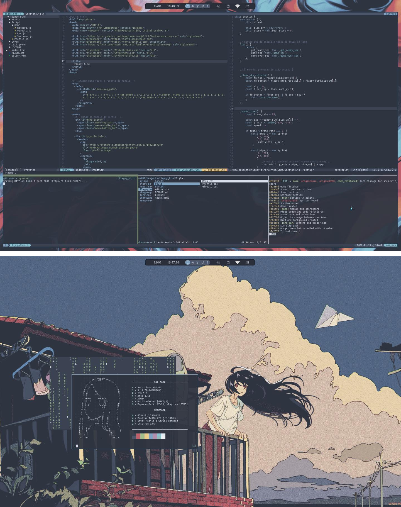

# Setup created to be beatyfull and fast at the same time 💪

### What's inside?

- [Neovim](https://github.com/neovim/neovim) + [Tmux](https://github.com/tmux/tmux) = ❤️
- [Zsh](https://www.zsh.org/) and [Oh My Zsh](https://ohmyz.sh/)
- [Ranger](https://github.com/ranger/ranger)
- [Vim](https://www.vim.org/)
- [Rofi](https://github.com/davatorium/rofi)

<!--   -->

- [Nord color palette](https://www.nordtheme.com/)
- XFCE4 Desktop Environment

### How it looks like

